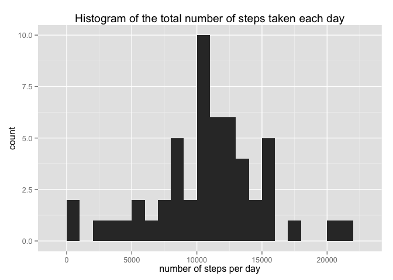
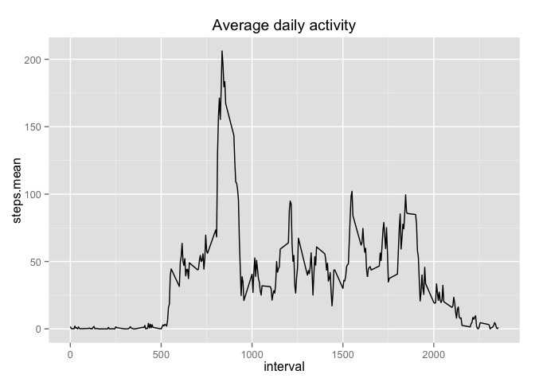
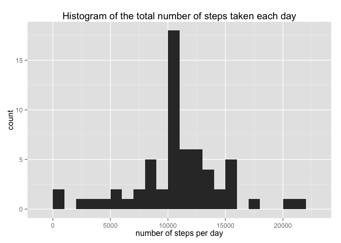
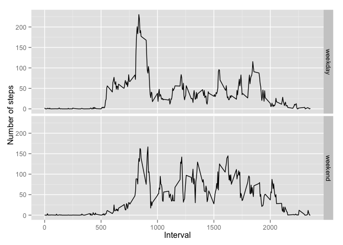

# Reproducible Research: Peer Assessment 1


## Loading and preprocessing the data

```r
unzip(zipfile="activity.zip")
activity <- read.csv("activity.csv")
```

### Dataset info

```r
names(activity)
```

```
## [1] "steps"    "date"     "interval"
```

```r
str(activity)
```

```
## 'data.frame':	17568 obs. of  3 variables:
##  $ steps   : int  NA NA NA NA NA NA NA NA NA NA ...
##  $ date    : Factor w/ 61 levels "2012-10-01","2012-10-02",..: 1 1 1 1 1 1 1 1 1 1 ...
##  $ interval: int  0 5 10 15 20 25 30 35 40 45 ...
```

```r
head(activity, 5)
```

```
##   steps       date interval
## 1    NA 2012-10-01        0
## 2    NA 2012-10-01        5
## 3    NA 2012-10-01       10
## 4    NA 2012-10-01       15
## 5    NA 2012-10-01       20
```

```r
summary(activity)
```

```
##      steps                date          interval     
##  Min.   :  0.00   2012-10-01:  288   Min.   :   0.0  
##  1st Qu.:  0.00   2012-10-02:  288   1st Qu.: 588.8  
##  Median :  0.00   2012-10-03:  288   Median :1177.5  
##  Mean   : 37.38   2012-10-04:  288   Mean   :1177.5  
##  3rd Qu.: 12.00   2012-10-05:  288   3rd Qu.:1766.2  
##  Max.   :806.00   2012-10-06:  288   Max.   :2355.0  
##  NA's   :2304     (Other)   :15840
```

### Data complete cases - remove (NA)

```r
Completeactivity <- complete.cases(activity)
activity.wo.na <- activity[Completeactivity,]
```

## Mean total number of steps taken per day
#### For this part we will ignore the missing values in the dataset.

```r
library(ggplot2)
Total.Steps.PerDay <- aggregate(steps ~ date, data = activity.wo.na, sum)
qplot(Total.Steps.PerDay$steps, xlab = "number of steps per day",binwidth = 1000, main = "Histogram of the total number of steps taken each day")
```

 

#### Calculate the mean and median of the total number of steps taken per day

```r
steps.mean <- mean(Total.Steps.PerDay$steps)
```
##### mean is 1.0766189\times 10^{4}

```r
steps.median <- median(Total.Steps.PerDay$steps)
```
##### median is 10765

## Average daily activity pattern
#### Plot the average number of steps taken, 5-minute interval (x-axis) & averaged across all days (y-axis)

```r
activity.interval <- aggregate(steps ~ interval, data = activity.wo.na, mean)
colnames(activity.interval) <- c("interval", "steps.mean")
ggplot(activity.interval, aes(interval, steps.mean)) + 
    geom_line() + 
    labs(title = expression("Average daily activity"))
```

 

#### Calculate the max 5-minute interval

```r
Max.5min <- activity.interval[which.max(activity.interval$steps),]
```
##### The max 5-minute interval is 835 at average 206 steps 


## Imputing missing values

#### Calculate the total number of missing values in data set

```r
missing.val <- sum(!complete.cases(activity))
```
##### Total number of missing values: 2304 out of 17568

#### Fill missing value from mean dataset for the 5-minute interval

```r
fill.activity <- merge(activity, activity.interval, by = 'interval')
fill.activity$steps[is.na(fill.activity$steps)] <- as.integer(round(fill.activity$steps.mean[is.na(fill.activity$steps)]))
new.activity <- fill.activity[,1:3]
```

### New Dataset info

```r
names(new.activity)
```

```
## [1] "interval" "steps"    "date"
```

```r
str(new.activity)
```

```
## 'data.frame':	17568 obs. of  3 variables:
##  $ interval: int  0 0 0 0 0 0 0 0 0 0 ...
##  $ steps   : int  2 0 0 0 0 0 0 0 0 0 ...
##  $ date    : Factor w/ 61 levels "2012-10-01","2012-10-02",..: 1 54 28 37 55 46 20 47 38 56 ...
```

```r
head(new.activity, 5)
```

```
##   interval steps       date
## 1        0     2 2012-10-01
## 2        0     0 2012-11-23
## 3        0     0 2012-10-28
## 4        0     0 2012-11-06
## 5        0     0 2012-11-24
```

```r
summary(new.activity)
```

```
##     interval          steps                date      
##  Min.   :   0.0   Min.   :  0.00   2012-10-01:  288  
##  1st Qu.: 588.8   1st Qu.:  0.00   2012-10-02:  288  
##  Median :1177.5   Median :  0.00   2012-10-03:  288  
##  Mean   :1177.5   Mean   : 37.38   2012-10-04:  288  
##  3rd Qu.:1766.2   3rd Qu.: 27.00   2012-10-05:  288  
##  Max.   :2355.0   Max.   :806.00   2012-10-06:  288  
##                                    (Other)   :15840
```

#### For this part we will use data with filled-in missing.

```r
new.Total.Steps.PerDay <- aggregate(steps ~ date, data = new.activity, sum)
qplot(new.Total.Steps.PerDay$steps, xlab = "number of steps per day",binwidth = 1000, main = "Histogram of the total number of steps taken each day")
```

 

#### Calculate the mean and median of the total number of steps taken per day

```r
new.steps.mean <- mean(new.Total.Steps.PerDay$steps)
```
##### mean is 1.0766189\times 10^{4}

```r
new.steps.median <- median(new.Total.Steps.PerDay$steps)
```
##### median is 10765

#### Do these values differ from the estimates from the first part of the assignment?
##### There is slight different between two dataset

#### What is the impact of imputing missing data on the estimates of the total daily number of steps
##### No much impact as we used average to fill missing values.


## Are there differences in activity patterns between weekdays and weekends?  

#### For this part we will use data with filled-in missing.  


#### Create a new factor variable in the dataset with two levels – “weekday” and “weekend” indicating whether a given date is a weekday or weekend day.

```r
new.activity$date <- as.Date(new.activity$date)
new.activity$day <- sapply(new.activity$date, FUN = function(x){
    day <- weekdays(x)
    if (day %in% c("Saturday", "Sunday"))
        return("weekend")
    else
        return("weekday")
})
```

### Weekday and weekend dataset info

```r
names(new.activity)
```

```
## [1] "interval" "steps"    "date"     "day"
```

```r
str(new.activity)
```

```
## 'data.frame':	17568 obs. of  4 variables:
##  $ interval: int  0 0 0 0 0 0 0 0 0 0 ...
##  $ steps   : int  2 0 0 0 0 0 0 0 0 0 ...
##  $ date    : Date, format: "2012-10-01" "2012-11-23" ...
##  $ day     : chr  "weekday" "weekday" "weekend" "weekday" ...
```

```r
head(new.activity, 5)
```

```
##   interval steps       date     day
## 1        0     2 2012-10-01 weekday
## 2        0     0 2012-11-23 weekday
## 3        0     0 2012-10-28 weekend
## 4        0     0 2012-11-06 weekday
## 5        0     0 2012-11-24 weekend
```

#### Plot of the 5-minute interval (x-axis) and the average number of steps taken, averaged across all weekday days or weekend days (y-axis)

```r
week.average.steps <- aggregate(steps ~ interval + day, data = new.activity, mean)
ggplot(week.average.steps, aes(interval, steps)) + 
    geom_line() + 
    facet_grid(day ~ .) +
    xlab("Interval") + ylab("Number of steps")
```

 
